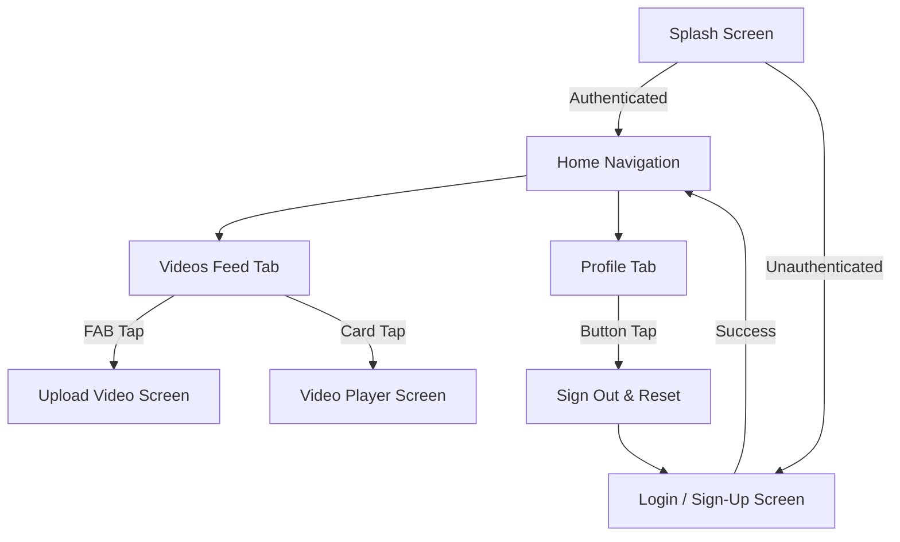

# 🚀 InternConnect

### 📲 [Download the Android APK Release Here](https://drive.google.com/file/d/16QrAGyfqzjFqhD7wS27qusK6MSCCyeLd/view?usp=sharing)

A modern, high-performance Flutter mobile application designed to connect and onboard interns. InternConnect provides a scannable, interactive space where interns can upload short video introductions, share their academic backgrounds, display their tech interests, and build professional networks within their cohort.

Built with **Flutter (Material 3)** and powered by **Firebase**, this application leverages a modular, scalable architecture engineered for speed, clean state management, and an exceptional user experience.

---

## 📸 Application Preview & Visual Flow



---

## ✨ Features

### 🔐 Secure Authentication & Session Handling
- **Firebase Auth Integration:** Email and password sign-in & sign-up forms with comprehensive client-side form validation.
- **Auto-Login:** Smooth splash routing check ensures returning users skip authentication steps.
- **Friendly Exceptions:** Custom Firebase error mapper converts raw system exceptions into user-friendly validation messages.

### 🎬 Interactive Video Feed
- **Dynamic Content Stream:** Streams video metadata directly from Cloud Firestore ordered by upload time.
- **Video Card Previews:** Quick scannable cards displaying full names, handles, tech chips, and relative time stamps (e.g. *"2 minutes ago"*).
- **Responsive Navigation:** Smooth animations transition the user to a dedicated video player.

### 📤 Video Upload & Storage Pipeline
- **Firebase Storage Integration:** Uploads `.mp4` video files to a secure cloud bucket structure.
- **Firestore Metadata Association:** Automatically binds video records to the authenticated uploader's email address and profile.
- **Camera/Gallery Picker:** Seamless camera recording or gallery video picking using the native image picker interface.

### ▶️ Premium Video Playback
- **Chewie & Video Player Integration:** Native aspect ratio video playback with embedded seek, volume, and playback speed controllers.
- **Uploader Profile Cards:** Displays associated uploader info underneath the playback console.

### ⚙️ Video Management & Sharing
- **Full CRUD Control:** Uploader-exclusive permissions to seamlessly Edit metadata or Delete their video records from the cloud.
- **Native Exporting:** Share content instantly to other apps using native iOS/Android share sheets.

### 👤 Interactive Profile Management
- **User Dashboard:** Dedicated panel displaying user credentials and account settings.
- **Secure Sign-Out:** Clean session destruction that clears local routing queues and returns the user to the login screen.

---

## 🛠️ Tech Stack & Dependencies

| Layer | Technology / Package | Purpose |
| :--- | :--- | :--- |
| **Core Framework** | Flutter (Dart SDK >= 3.11.5) | Cross-platform UI development |
| **UI Spec** | Material 3 (M3) | Fluid layouts, chip tokens, dynamic inputs |
| **Authentication** | `firebase_auth` | User sessions and credential security |
| **Database** | `cloud_firestore` | Real-time metadata storing and querying |
| **Storage** | `firebase_storage` | Video file hosting |
| **Video Player** | `video_player` & `chewie` | Playback control and codec wrappers |
| **Media Picker** | `image_picker` | Video capture and directory browsing |
| **Utilities** | `uuid`, `intl`, `timeago` | Unique IDs, date formatting, relative time calculation |

---

## 📂 Directory Structure

The project follows a structured, feature-based directory design to isolate business logic, screen components, and models:

```
lib/
├── main.dart                 # App Entry Point & Firebase initialization
├── models/
│   └── intern_video.dart     # Video data model & serialization logic
├── screens/
│   ├── home_screen.dart      # Bottom Navigation controller
│   ├── login_screen.dart     # Authentication interface
│   ├── profile_screen.dart   # User details & session controls
│   ├── splash_screen.dart    # Loader & router guard
│   ├── upload_video_screen.dart # Form for uploading video files
│   ├── video_player_screen.dart # Player wrapper for video streaming
│   └── videos_feed_screen.dart  # Interactive feed stream list
├── services/
│   ├── auth_service.dart     # Auth wrapper for sign-in/up/out
│   └── video_service.dart    # Handles Storage uploads and Firestore writes
└── theme/
    └── app_theme.dart        # Custom Material 3 themes configuration
```

---

## 🚀 Setup & Installation

Follow these steps to set up InternConnect on your local development machine:

### 1. Prerequisites
Ensure you have the following installed:
* [Flutter SDK](https://docs.flutter.dev/get-started/install)
* [Java Development Kit (JDK 17)](https://adoptium.net/)
* Android Studio / Xcode (for simulators/emulators)

### 2. Clone the Repository
```bash
git clone https://github.com/withshafan/intern_connect.git
cd intern_connect
```

### 3. Firebase Configuration
* Create a Firebase project named **InternConnect** in the [Firebase Console](https://console.firebase.google.com/).
* Register your Android package (`com.example.intern_connect`) and download the generated `google-services.json`.
* Place `google-services.json` in the `android/app/` folder.
* Enable **Email/Password Authentication**, **Cloud Firestore**, and **Firebase Storage** in your Firebase console.

### 4. Fetch Dependencies & Run
Download the Dart packages and launch the app:
```bash
flutter pub get
flutter run
```

---

## 🔮 Roadmap / Future Enhancements
- [ ] **Staggered Grid View:** Migrate the feed into a 2-column masonry grid.
- [x] **Thumbnail Generation:** Auto-create video frame snapshots during upload.
- [x] **Video Management:** Edit, Delete, and Share functionality.
- [ ] **Likes & Reactions:** Allow interns to upvote or interact with video profiles.
- [ ] **Search & Tag Filters:** Filter users by tech tags (Flutter, AI/ML, Web, Cloud) and name/nickname queries.
- [ ] **Richer Profiles:** Editable biographies, GitHub/LinkedIn links, and a personal video grid.
